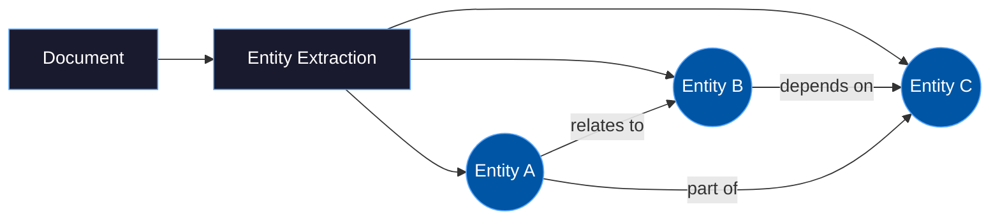
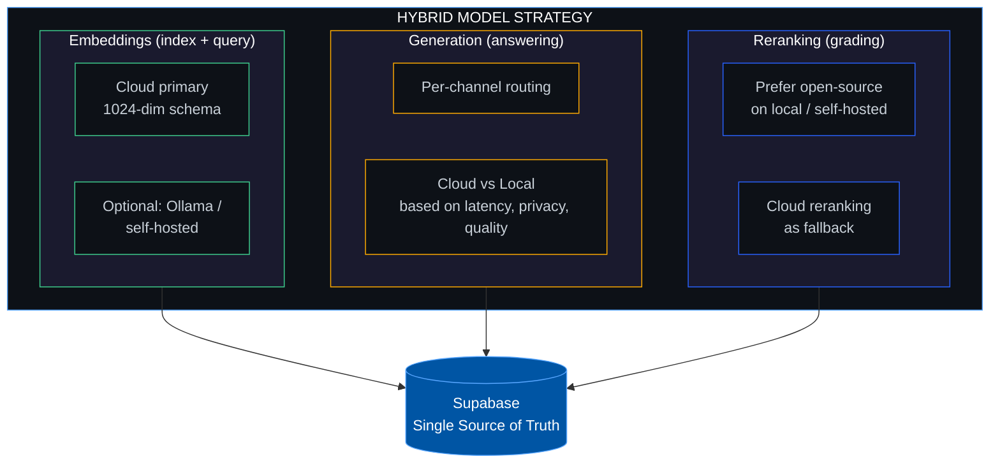

<div align="center">

<br>

<picture>
  <source media="(prefers-color-scheme: dark)" srcset="https://readme-typing-svg.demolab.com?font=Fira+Code&weight=700&size=28&duration=3000&pause=1000&color=58A6FF&center=true&vCenter=true&multiline=true&repeat=false&width=700&height=80&lines=INFOFLOW+RAG+Research;TMT+%7C+Business+Solutions">
  <source media="(prefers-color-scheme: light)" srcset="https://readme-typing-svg.demolab.com?font=Fira+Code&weight=700&size=28&duration=3000&pause=1000&color=0055A4&center=true&vCenter=true&multiline=true&repeat=false&width=700&height=80&lines=INFOFLOW+RAG+Research;TMT+%7C+Business+Solutions">
  
</picture>

<br>

**Retrieval-Augmented Generation Pipeline &mdash; Research & Optimization**

<br>

[]()
[]()
[]()
[]()

<br>

```ansi
╔══════════════════════════════════════════════════════════════════════╗
║                                                                      ║
║   Improving document ingestion, chunking, retrieval, and             ║
║   generation quality for the INFOFLOW RAG pipeline.                  ║
║                                                                      ║
║   5 Research Areas  ·  8 Priorities  ·  Hybrid Deployment Strategy   ║
║                                                                      ║
╚══════════════════════════════════════════════════════════════════════╝
```

<br>

<a href="#-research-area-1-document-processing--chunking">
  
</a>&nbsp;
<a href="#-research-area-2-multi-modal-document-ingestion">
  
</a>&nbsp;
<a href="#-research-area-3-retrieval-improvements">
  
</a>&nbsp;
<a href="#-research-area-4-alternative-architectures">
  
</a>&nbsp;
<a href="#-research-area-5-evaluation--benchmarking">
  
</a>&nbsp;
<a href="#%EF%B8%8F-model-deployment-strategy-cloud--local">
  
</a>&nbsp;
<a href="#-prioritization-roadmap">
  
</a>&nbsp;
<a href="#-references">
  
</a>

</div>

<br>

---

<br>

## Overview

This document presents research into **five key areas** for improving the INFOFLOW RAG pipeline, along with a **model deployment strategy**, a **prioritized implementation roadmap**, and a comprehensive **reference list**.

The current stack is built on **Supabase / PostgreSQL** with **LangChain** and uses vector cosine similarity for retrieval. Each research area identifies concrete improvements that remain compatible with this architecture.


<br>

---

<br>

##  Research Area 1: Document Processing & Chunking

> [!NOTE]
> **Chunking determines how documents are decomposed into searchable units.** Our fixed character limit (1000 chars) cuts sentences and paragraphs without regard for semantic boundaries. Better chunking strategies can significantly improve retrieval quality.

<br>

### Approaches

<details open>
<summary><h4>Semantic Chunking</h4></summary>

<table>
<tr><td>

Chunks are formed based on **semantic similarity** instead of a fixed character count. The text is split into sentences, embeddings are calculated, and splits are made where semantic similarity between consecutive sentences falls below a threshold.

| Tool | Notes |
|:-----|:------|
| `LangChain SemanticChunker` | Experimental |
| `LlamaIndex SemanticSplitterNodeParser` | Production-ready |
| `chonkie` | Lightweight library, multiple strategies |

</td></tr>
</table>

</details>

<details>
<summary><h4>Late Chunking <sub>(Jina AI)</sub></h4></summary>

<table>
<tr><td>

Instead of chunking first and then embedding, the **entire document** is processed by a long-context embedding model. Token embeddings are then divided into chunks and pooled. This allows the document context to flow into each chunk.

- Jina AI Blog: Late Chunking
- Requires specific embedding models with long context (e.g., `jina-embeddings-v2`)

</td></tr>
</table>

</details>

<details>
<summary><h4>Structure-aware Chunking</h4></summary>

<table>
<tr><td>

Uses document structure (headings, paragraphs, tables, lists) as chunk boundaries instead of a fixed character count.

| Tool | Description |
|:-----|:------------|
| `Docling` (IBM) | Understands document structure, provides structured output |
| `Unstructured.io` | Analyzes layouts and extracts structured elements |

</td></tr>
</table>

</details>

<details>
<summary><h4>Contextual Retrieval <sub>(Anthropic)</sub></h4></summary>

<table>
<tr><td>

Each chunk is enriched during indexing with a short context section explaining where the chunk is located within the overall document. This contextual prefix is prepended to the chunk text before the embedding is calculated.

> According to Anthropic, this reduces "failed retrievals" by up to **49%**.

- Can be combined with BM25 and Reranking

</td></tr>
</table>

</details>

<details>
<summary><h4>Parent-Child Document Retrieval</h4></summary>

<table>
<tr><td>

Small chunks are used for retrieval (high precision), but the parent chunk (larger text section) is returned when inserted into the LLM context. This provides the LLM with more context.

| Tool | Notes |
|:-----|:------|
| `LangChain ParentDocumentRetriever` | Recommended |
| LangChain Docs: Parent Document Retriever | Documentation |

</td></tr>
</table>

</details>

<br>

> [!TIP]
> **Relevance for our Stack** &mdash; Our `RecursiveCharacterTextSplitter` is the simplest approach. **Semantic Chunking** and **Contextual Retrieval** are promising improvements and can be introduced without changing the Supabase storage architecture. Structure-aware chunking is particularly relevant for PDFs with complex layouts. These methods are Supabase-compatible on the storage side, but can require additional compute/runtime dependencies during ingestion.

<br>

---

<br>

##  Research Area 2: Multi-modal Document Ingestion

> [!NOTE]
> **Currently, we only process text from documents.** Scanned PDFs, images, tables, and complex layouts are captured poorly or not at all. Many user documents contain exactly such content.

<br>

### Approaches

<details open>
<summary><h4>OCR for Scanned PDFs / Images</h4></summary>

<table>
<tr><td>

Our `PyPDFLoader` only extracts embedded text. Scanned documents yield empty results.

| Tool | Type | Highlights |
|:-----|:-----|:-----------|
| **Tesseract OCR** |  | Locally executable, good for simple text recognition |
| **DocTR** |  | Deep-learning-based, better than Tesseract for complex layouts |
| **Google Vertex AI Document AI** |  | 200+ printed and 50+ handwritten languages |

</td></tr>
</table>

</details>

<details>
<summary><h4>Table Extraction</h4></summary>

<table>
<tr><td>

Tables in PDFs are often lost or rendered unusable during text-based parsing.

| Tool | Type | Highlights |
|:-----|:-----|:-----------|
| **Docling + TableFormer** |  | Deep-learning-based table recognition; also usable for structured chunking |
| **Camelot** |  | Python library specifically for tables in PDFs |
| **Unstructured.io** |  | Recognizes and extracts tables as structured elements |

</td></tr>
</table>

</details>

<details>
<summary><h4>Visual Document Understanding</h4></summary>

<table>
<tr><td>

Instead of extracting text from documents, documents are analyzed as **images**. Multi-modal models understand layout, text, and images simultaneously.

| Tool | Description |
|:-----|:------------|
| **ColPali** | Open-source Vision-Language Model specifically for document retrieval; embeds document pages as images |

</td></tr>
</table>

</details>

<br>

> [!TIP]
> **Relevance for our Stack** &mdash; All approaches are open-source and can run locally or self-hosted. **Docling** is particularly promising as it combines OCR, table extraction, and structured chunking in one library. Extracted text and embeddings continue to be stored in Supabase/pgvector. For multi-modal retrieval (e.g. ColPali), treat this as an **advanced track** &mdash; feasible with Supabase, but needs a dedicated image-page embedding path and careful latency/cost benchmarking.

<br>

---

<br>

##  Research Area 3: Retrieval Improvements

> [!NOTE]
> **Our retrieval is based exclusively on vector cosine similarity.** This works well for semantic search but fails for exact terms, technical terminology, and proper names. Several techniques can improve retrieval quality.

<br>

### Approaches

<details open>
<summary><h4>Hybrid Search <sub>(Vector + BM25)</sub></h4></summary>

<table>
<tr><td>

Combines semantic vector search with keyword-based full-text search (BM25-style lexical ranking). Finds both conceptually similar **and** exactly matching documents. Results are merged using **Reciprocal Rank Fusion (RRF)**.

```
  Semantic Vector Search ──┐
                           ├──► Reciprocal Rank Fusion (RRF) ──► Final Results
  BM25 Full-Text Search ───┘
```

- **Supabase / PostgreSQL native** `tsvector` / `ts_rank` &mdash; built into PostgreSQL, zero additional dependencies
- Preferred path for managed Supabase projects

</td></tr>
</table>

</details>

<details open>
<summary><h4>Reranking</h4></summary>

<table>
<tr><td>

After initial retrieval, results are **re-sorted by relevance** using a specialized cross-encoder model. Our existing `AzureGraderCompressor` in `db/reranker.py` uses a full LLM call per document, which is slow and expensive. Dedicated reranker models score query-document pairs in a single forward pass and typically add only **100&ndash;600ms** while improving retrieval accuracy by **15&ndash;40%**.

| Model | License | Notes |
|:------|:--------|:------|
| **mxbai-rerank-v2** (Mixedbread) |  | Current SOTA, 0.5B/1.5B, 100+ languages, 8k context |
| **BAAI/bge-reranker-v2-m3** |  | Proven cross-encoder, good all-round performance |
| **Jina Reranker v2** |  | Fast, multilingual, flash attention |
| **FlashRank** |  | ONNX-optimized, runs fast on CPU, no-GPU fallback |
| **rerankers** (AnswerDotAI) |  | Unified Python API, useful for rapid benchmarking |

> **First step:** Replace the LLM-based grader with a dedicated cross-encoder and benchmark against the current pipeline.

</td></tr>
</table>

</details>

<details>
<summary><h4>HyDE <sub>(Hypothetical Document Embeddings)</sub></h4></summary>

<table>
<tr><td>

Instead of embedding the user's question directly, an LLM first generates a **hypothetical answer**. This is then embedded and used for retrieval. The hypothetical answer is semantically closer to the actual documents than the question.

```
  User Question ──► LLM generates hypothetical answer ──► Embed answer ──► Retrieve
```

- Paper: *Precise Zero-Shot Dense Retrieval without Relevance Labels*

</td></tr>
</table>

</details>

<details>
<summary><h4>Reverse HyDE</h4></summary>

<table>
<tr><td>

Conversely &mdash; for each chunk during **indexing**, a hypothetical question is generated that this chunk could answer. Retrieval then compares question with question.

```
  Chunk ──► LLM generates question ──► Embed question ──► Store
  User Question ──► Embed ──► Match against stored questions
```

</td></tr>
</table>

</details>

<details>
<summary><h4>Multi-Query Retrieval</h4></summary>

<table>
<tr><td>

A single user question is reformulated into **several variants** by the LLM. Searching is performed separately for each variant, and results are merged and deduplicated. Increases recall, especially for ambiguous questions.

- LangChain Docs: `MultiQueryRetriever`

</td></tr>
</table>

</details>

<br>

> [!TIP]
> **Relevance for our Stack** &mdash; **Hybrid Search** has the best effort-to-benefit ratio: Supabase/PostgreSQL already has native `tsvector` full-text search and `match_documents` can be extended without a separate search system. **Replacing the LLM-based grader** with `mxbai-rerank-v2` is a quick win &mdash; significantly faster and more effective than `AzureGraderCompressor`. HyDE and Multi-Query are simple LangChain extensions.

<br>

---

<br>

##  Research Area 4: Alternative Architectures

> [!NOTE]
> In addition to improvements to the existing pipeline, there are **fundamentally different approaches** that may be better suited for certain use cases.

<br>

### Approaches

<details open>
<summary><h4>GraphRAG / Knowledge Graphs</h4></summary>

<table>
<tr><td>

Instead of (or in addition to) vectors, **knowledge graphs** are extracted from documents. Entities and their relationships are stored. Particularly good for questions requiring connections across multiple documents.



- **Microsoft GraphRAG** &mdash; open-source framework, LLM-based entity and relation extraction
- Paper: *From Local to Global &mdash; A Graph RAG Approach*
- Can be persisted in standard PostgreSQL tables (recommended baseline)
- High effort during indexing, but better answers for relationship-based questions

</td></tr>
</table>

</details>

<details>
<summary><h4>RAPTOR <sub>(Recursive Abstractive Processing for Tree-Organized Retrieval)</sub></h4></summary>

<table>
<tr><td>

Document chunks are **summarized hierarchically**. A tree is created: original chunks at the bottom, increasingly abstract summaries above. Retrieval can take place at different abstraction levels.

```
            ┌──────────────────────┐
            │   Global Summary     │  ◄── Most abstract
            └──────────┬───────────┘
               ┌───────┴───────┐
         ┌─────┴─────┐   ┌────┴──────┐
         │ Section A  │   │ Section B  │
         └─────┬──────┘   └────┬──────┘
          ┌────┴────┐      ┌───┴────┐
        ┌─┴──┐ ┌──┴─┐  ┌──┴─┐ ┌──┴─┐
        │ C1 │ │ C2 │  │ C3 │ │ C4 │  ◄── Original chunks
        └────┘ └────┘  └────┘ └────┘
```

- Paper: *RAPTOR: Recursive Abstractive Processing for Tree-Organized Retrieval*
- Compatible with our existing `auto_summarize` feature

</td></tr>
</table>

</details>

<br>

> [!TIP]
> **Relevance for our Stack** &mdash; These approaches are more relevant in the **medium to long term**. Both RAPTOR and GraphRAG are open-source. A Supabase-compatible baseline stores summaries, graph nodes/edges, and embeddings in standard PostgreSQL tables; advanced graph extensions remain optional.

<br>

---

<br>

##  Research Area 5: Evaluation & Benchmarking

> [!WARNING]
> **Without metrics, we cannot objectively assess whether changes improve or degrade the pipeline.** An evaluation framework should be set up **before** the other improvements are implemented.

<br>

### Approaches

<details open>
<summary><h4>RAGAS Framework</h4></summary>

<table>
<tr><td>

The standard framework for evaluating RAG pipelines. It assesses both retrieval and generation quality.

- GitHub: `explodinggradients/ragas`

</td></tr>
</table>

**Key Metrics:**

| Metric | Measures | Question it Answers |
|:-------|:---------|:--------------------|
| **Context Precision** |  | How many of the retrieved documents are actually relevant? |
| **Context Recall** |  | How many of the relevant documents were found? |
| **Faithfulness** |  | Is the generated answer supported by the source documents? |
| **Answer Relevancy** |  | Does the answer actually address the question that was asked? |

</details>

<details open>
<summary><h4>Creating a Golden Dataset</h4></summary>

<table>
<tr><td>

A manually curated dataset of question-answer pairs with associated source documents. This serves as the **foundation for all evaluations**.

- [x] **50&ndash;100** question-answer pairs are a good starting point
- [x] Questions should cover various difficulty levels and question types
- [x] The expected source documents should be annotated
- [x] RAGAS Docs: Test Set Generation

</td></tr>
</table>

</details>

<br>

> [!IMPORTANT]
> **Evaluation should be the first step** before other improvements are implemented. Only then can we measure the current state and quantify improvements. The golden dataset can be created using existing theme channels and documents.

<br>

---

<br>

## &#x2601;&#xFE0F; Model Deployment Strategy (Cloud + Local)

> To keep flexibility, cost control, and data-sovereignty options, use a **hybrid model strategy**.

<br>



<br>

> [!CAUTION]
> **Note on local inference:** Self-hosted / local model deployment (e.g. via Ollama or on-premise GPU infrastructure) is only a realistic option for advanced or enterprise customers. The associated hardware and operational costs are only justifiable at scale. For standard customers, cloud-based inference endpoints remain the default path.

<br>

---

<br>

## &#x1F3AF; Prioritization Roadmap

> Recommended order based on **effort vs. expected impact**.

<br>

| # | Area | Effort | Impact | Reasoning |
|:-:|:-----|:------:|:------:|:----------|
|  | **Hybrid Search** (`tsvector` + Vector) |  |  | PostgreSQL has native support, `match_documents` can be extended |
|  | **Semantic Chunking** |  |  | Replaces `RecursiveCharacterTextSplitter`, easily evaluable |
|  | **OCR / Table & Structure Extraction** |  |  | Docling + Tesseract/DocTR are open-source; unlocks unusable docs |
|  | **Integrate Reranking** |  |  | Replace LLM grader with cross-encoder; much faster & effective |
|  | **Establish Evaluation** (RAGAS + Golden Dataset) |  |  | Cannot measure improvement without a baseline |
|  | **Contextual Retrieval** |  |  | Chunk enrichment during indexing, no infra changes needed |
|  | **HyDE / Multi-Query** |  |  | LangChain modules, quickly prototyped |
|  | **RAPTOR / GraphRAG** |  |  | Fundamental research, long-term horizon |

<br>

---

<br>

## &#x1F4DA; References

<br>

<details>
<summary>&nbsp;&nbsp;&nbsp;&nbsp;<b>General</b></summary>

<br>

| Resource |
|:---------|
| Building Enterprise AI: Hard-Won Lessons from 1200+ Hours of RAG Development (ByteVagabond) |

</details>

<details>
<summary>&nbsp;&nbsp;&nbsp;&nbsp;<b>Chunking & Ingestion</b></summary>

<br>

| Resource |
|:---------|
| LangChain Text Splitters Documentation |
| Anthropic: Contextual Retrieval |
| Jina AI: Late Chunking |
| `chonkie` &mdash; Chunking Library |
| Docling (IBM) |
| Unstructured.io Documentation |
| LangChain: Parent Document Retriever |

</details>

<details>
<summary>&nbsp;&nbsp;&nbsp;&nbsp;<b>Multi-modal Ingestion</b></summary>

<br>

| Resource |
|:---------|
| Tesseract OCR |
| DocTR |
| Camelot &mdash; Table Extraction |
| ColPali |

</details>

<details>
<summary>&nbsp;&nbsp;&nbsp;&nbsp;<b>Retrieval</b></summary>

<br>

| Resource |
|:---------|
| Supabase Full Text Search |
| LangChain: Hybrid Search |
| ColBERT |
| `mxbai-rerank-v2` (Mixedbread) |
| `rerankers` &mdash; Unified Reranker API (AnswerDotAI) |
| Agentset Reranker Leaderboard |
| Paper: HyDE &mdash; Precise Zero-Shot Dense Retrieval |
| LangChain: MultiQueryRetriever |

</details>

<details>
<summary>&nbsp;&nbsp;&nbsp;&nbsp;<b>Alternative Architectures</b></summary>

<br>

| Resource |
|:---------|
| Microsoft GraphRAG |
| Paper: From Local to Global &mdash; Graph RAG |
| Paper: RAPTOR |
| LangChain: RAPTOR Tutorial |

</details>

<details>
<summary>&nbsp;&nbsp;&nbsp;&nbsp;<b>Evaluation</b></summary>

<br>

| Resource |
|:---------|
| RAGAS Documentation |
| RAGAS GitHub |
| RAGAS: Test Set Generation |

</details>

<br>

---

<div align="center">

<br>

```
████████╗███╗   ███╗████████╗
╚══██╔══╝████╗ ████║╚══██╔══╝
   ██║   ██╔████╔██║   ██║
   ██║   ██║╚██╔╝██║   ██║
   ██║   ██║ ╚═╝ ██║   ██║
   ╚═╝   ╚═╝     ╚═╝   ╚═╝
```

**Business Solutions**

<sub>INFOFLOW RAG Research &bull; 24.02.2026 &bull; Pages 1&ndash;15</sub>

<br>

[]()

</div>
