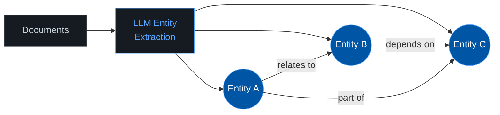
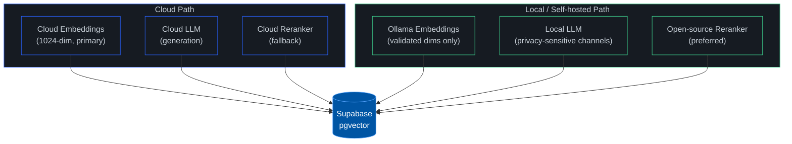

<div align="center">

<br>

<picture>
  <source media="(prefers-color-scheme: dark)" srcset="https://readme-typing-svg.demolab.com?font=Inter&weight=800&size=36&duration=3000&pause=1000&color=58A6FF&center=true&vCenter=true&repeat=false&width=550&height=45&lines=INFOFLOW+RAG+Research">
  <source media="(prefers-color-scheme: light)" srcset="https://readme-typing-svg.demolab.com?font=Inter&weight=800&size=36&duration=3000&pause=1000&color=0D1117&center=true&vCenter=true&repeat=false&width=550&height=45&lines=INFOFLOW+RAG+Research">
  
</picture>

<br>

<kbd>&nbsp;&nbsp;TMT | Business Solutions&nbsp;&nbsp;</kbd>&nbsp;&nbsp;&nbsp;<kbd>&nbsp;&nbsp;24.02.2026&nbsp;&nbsp;</kbd>

<br><br>

Improving chunking, ingestion, retrieval, and generation<br>for the INFOFLOW RAG pipeline on **Supabase + LangChain**.

<br>

[]()&nbsp;
[]()&nbsp;
[]()&nbsp;
[]()

<br>

---

**[Chunking](#1--chunking)** · **[Multi-modal](#2--multi-modal-ingestion)** · **[Retrieval](#3--retrieval)** · **[Architectures](#4--alternative-architectures)** · **[Evaluation](#5--evaluation)** · **[Deployment](#-deployment-strategy)** · **[Roadmap](#-roadmap)**

---

</div>

<br>

## Current pipeline


<sup>Red = bottleneck this research addresses.</sup>

**Problems:** Fixed 1000-char chunking ignores semantics. No OCR for scans. Vector-only retrieval misses keyword matches. LLM-based reranker is slow and expensive.

<br>

---

<br>

## 1 &mdash; Chunking

> Current: `RecursiveCharacterTextSplitter` at 1000 chars. Cuts mid-sentence, ignores document structure.

| Approach | How it works | Tools |
|:---------|:-------------|:------|
| **Semantic Chunking** | Split where embedding similarity between sentences drops below threshold | `LangChain SemanticChunker`, `LlamaIndex SemanticSplitterNodeParser`, `chonkie` |
| **Late Chunking** | Embed full document first, then pool token embeddings into chunks&mdash;context bleeds across boundaries | `jina-embeddings-v2` |
| **Structure-aware** | Use headings/paragraphs/tables as natural chunk boundaries | `Docling` (IBM), `Unstructured.io` |
| **Contextual Retrieval** | Prepend each chunk with a short LLM-generated context prefix at index time. Reduces failed retrievals by **~49%** (Anthropic) | Anthropic Blog; combinable with BM25 |
| **Parent-Child** | Small chunks for retrieval precision, return the larger parent chunk to the LLM for more context | `LangChain ParentDocumentRetriever` |

> [!TIP]
> **Quick wins:** Semantic Chunking and Contextual Retrieval drop in without changing Supabase schema. Structure-aware chunking is high-value for PDFs with complex layouts.

<br>

---

<br>

## 2 &mdash; Multi-modal Ingestion

> Current: `PyPDFLoader` extracts embedded text only. Scanned pages, images, and tables return nothing.

### OCR

| Tool | Type | Best for |
|:-----|:-----|:---------|
| **Tesseract** |  | Simple text, fast setup |
| **DocTR** |  | Complex layouts, deep-learning based |
| **Google Document AI** |  | 200+ printed / 50+ handwritten languages |

### Tables

| Tool | Notes |
|:-----|:------|
| **Docling + TableFormer** | DL-based table recognition + structured chunking in one library |
| **Camelot** | Python-native, PDF tables specifically |
| **Unstructured.io** | Extracts tables as structured elements |

### Visual understanding

| Tool | Notes |
|:-----|:------|
| **ColPali** | Vision-Language model that embeds document pages as images. Advanced track&mdash;needs dedicated embedding path. |

> [!TIP]
> **Recommendation:** Start with **Docling**&mdash;it handles OCR, tables, and structured chunking in a single open-source library. Everything stores back into Supabase/pgvector as before.

<br>

---

<br>

## 3 &mdash; Retrieval

> Current: Vector cosine similarity only. Misses exact terms, technical jargon, and proper names.

### Hybrid Search (Vector + BM25)

Combine semantic vectors with PostgreSQL full-text search. Merge results via **Reciprocal Rank Fusion**.

```
  Vector search  ─┐
                   ├─► RRF merge ─► Final ranked results
  BM25 (tsvector) ─┘
```

Zero new dependencies&mdash;`tsvector` / `ts_rank` are built into PostgreSQL. Extend `match_documents` and you're done.

### Reranking

Replace `AzureGraderCompressor` (full LLM call per doc) with a dedicated cross-encoder. Single forward pass, **100&ndash;600ms** added latency, **15&ndash;40% accuracy gain**.

| Model | License | Specs |
|:------|:-------:|:------|
| **mxbai-rerank-v2** |  | SOTA. 0.5B/1.5B params, 100+ langs, 8k context |
| **bge-reranker-v2-m3** |  | Solid all-rounder |
| **Jina Reranker v2** |  | Fast, multilingual, flash attention |
| **FlashRank** |  | ONNX, runs on CPU, no-GPU fallback |
| **rerankers** |  | Unified API across all models above |

### Query expansion

| Technique | Idea |
|:----------|:-----|
| **HyDE** | LLM generates a hypothetical answer &rarr; embed that instead of the question |
| **Reverse HyDE** | At index time, generate hypothetical questions per chunk &rarr; match question-to-question |
| **Multi-Query** | Rephrase user question into N variants, search each, deduplicate results |

> [!TIP]
> **Biggest bang for buck:** Hybrid Search (native PostgreSQL, no new infra) + swap in `mxbai-rerank-v2` for the LLM grader. HyDE/Multi-Query are quick LangChain add-ons.

<br>

---

<br>

## 4 &mdash; Alternative Architectures

> Longer-term approaches for use cases the current pipeline can't handle well.

### GraphRAG

Extract **knowledge graphs** from documents&mdash;entities and relationships. Excels at cross-document reasoning.



- **Microsoft GraphRAG**&mdash;open-source, LLM-based extraction
- Store in standard PostgreSQL tables (Apache AGE optional)
- High indexing effort, but unlocks relationship-based Q&A

### RAPTOR

Summarize chunks into a **hierarchy tree**. Query at any abstraction level.

```
             ┌──────────────┐
             │ Global summary│
             └──────┬───────┘
            ┌───────┴───────┐
      ┌─────┴─────┐   ┌────┴─────┐
      │ Section A  │   │ Section B │
      └──┬────┬───┘   └──┬───┬───┘
       [C1] [C2]       [C3] [C4]    ← original chunks
```

- Compatible with existing `auto_summarize`
- Store summaries + embeddings in Supabase alongside regular chunks

> [!NOTE]
> Both are open-source and Supabase-compatible. Start with standard PostgreSQL tables; graph extensions are optional.

<br>

---

<br>

## 5 &mdash; Evaluation

> [!WARNING]
> **Set this up before implementing anything else.** Without metrics, you can't tell if a change helped or hurt.

### RAGAS

Standard RAG evaluation framework. Measures retrieval **and** generation.

| Metric | What it measures |
|:-------|:-----------------|
| **Context Precision** | % of retrieved docs that are actually relevant |
| **Context Recall** | % of relevant docs that were retrieved |
| **Faithfulness** | Is the answer grounded in the source docs? |
| **Answer Relevancy** | Does the answer address the actual question? |

### Golden Dataset

Build a manually curated test set: **50&ndash;100 question-answer pairs** with annotated source documents. This is the baseline everything gets measured against.

- Cover multiple difficulty levels and question types
- Use existing theme channels and documents as source material
- RAGAS can auto-generate test sets to bootstrap this

<br>

---

<br>

## &#x2601;&#xFE0F; Deployment Strategy

> Hybrid cloud + local. Supabase stays the single source of truth.



| Layer | Primary | Local option |
|:------|:--------|:-------------|
| **Embeddings** | Cloud (1024-dim) | Ollama&mdash;only if dims and quality match |
| **Generation** | Cloud LLM | Per-channel routing to local models for privacy/latency |
| **Reranking** | Open-source local (preferred) | Cloud as fallback |

> [!CAUTION]
> Local inference (Ollama, on-prem GPU) is realistic only for enterprise customers at scale. Standard customers should default to cloud endpoints.

<br>

---

<br>

## &#x1F3AF; Roadmap

Ordered by **effort vs. impact**. Do evaluation early&mdash;you need a baseline before optimizing.

| | Area | Effort | Impact | Why |
|:-:|:-----|:------:|:------:|:----|
|  | **Hybrid Search** |  |  | Native PostgreSQL `tsvector`, just extend `match_documents` |
|  | **Semantic Chunking** |  |  | Drop-in replacement for `RecursiveCharacterTextSplitter` |
|  | **OCR + Table Extraction** |  |  | Unlocks scanned docs that currently return nothing |
|  | **Reranking** |  |  | Swap `AzureGraderCompressor` &rarr; `mxbai-rerank-v2` |
|  | **Evaluation** (RAGAS) |  |  | Can't improve what you can't measure |
|  | **Contextual Retrieval** |  |  | Enrich chunks at index time, no infra change |
|  | **HyDE / Multi-Query** |  |  | Quick LangChain prototypes |
|  | **RAPTOR / GraphRAG** |  |  | Long-term research track |

<br>

---

<br>

## &#x1F4DA; References

<details>
<summary><b>Chunking & Ingestion</b></summary>
<br>

- LangChain Text Splitters Documentation
- Anthropic: Contextual Retrieval
- Jina AI: Late Chunking
- `chonkie` &mdash; Chunking Library
- Docling (IBM)
- Unstructured.io
- LangChain: Parent Document Retriever

</details>

<details>
<summary><b>OCR & Multi-modal</b></summary>
<br>

- Tesseract OCR
- DocTR
- Camelot &mdash; Table Extraction
- ColPali

</details>

<details>
<summary><b>Retrieval & Reranking</b></summary>
<br>

- Supabase Full Text Search
- LangChain: Hybrid Search
- ColBERT
- `mxbai-rerank-v2` (Mixedbread)
- `rerankers` &mdash; Unified Reranker API (AnswerDotAI)
- Agentset Reranker Leaderboard
- Paper: HyDE &mdash; Precise Zero-Shot Dense Retrieval
- LangChain: MultiQueryRetriever

</details>

<details>
<summary><b>Alternative Architectures</b></summary>
<br>

- Microsoft GraphRAG
- Paper: From Local to Global &mdash; Graph RAG
- Paper: RAPTOR
- LangChain: RAPTOR Tutorial

</details>

<details>
<summary><b>Evaluation</b></summary>
<br>

- RAGAS Documentation
- RAGAS GitHub (`explodinggradients/ragas`)
- RAGAS: Test Set Generation

</details>

<details>
<summary><b>General</b></summary>
<br>

- Building Enterprise AI: Hard-Won Lessons from 1200+ Hours of RAG Development (ByteVagabond)

</details>

<br>

---

<div align="center">

<br>

```
████████╗███╗   ███╗████████╗
╚══██╔══╝████╗ ████║╚══██╔══╝
   ██║   ██╔████╔██║   ██║
   ██║   ██║╚██╔╝██║   ██║
   ██║   ██║ ╚═╝ ██║   ██║
   ╚═╝   ╚═╝     ╚═╝   ╚═╝
```

**TMT | Business Solutions**

<sub>INFOFLOW RAG Research &bull; 24.02.2026</sub>

</div>
