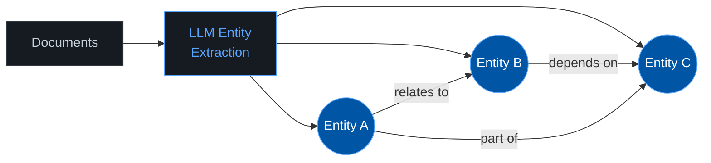
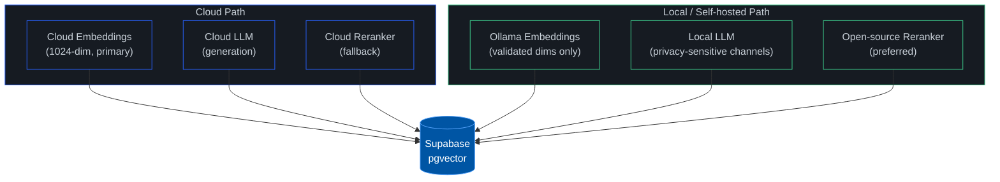

<div align="center">

<br>

<picture>
  <source media="(prefers-color-scheme: dark)" srcset="https://readme-typing-svg.demolab.com?font=Inter&weight=800&size=36&duration=3000&pause=1000&color=58A6FF&center=true&vCenter=true&repeat=false&width=550&height=45&lines=INFOFLOW+RAG+Research">
  <source media="(prefers-color-scheme: light)" srcset="https://readme-typing-svg.demolab.com?font=Inter&weight=800&size=36&duration=3000&pause=1000&color=0D1117&center=true&vCenter=true&repeat=false&width=550&height=45&lines=INFOFLOW+RAG+Research">
  
</picture>

<br>

<kbd>&nbsp;&nbsp;TMT | Business Solutions&nbsp;&nbsp;</kbd>&nbsp;&nbsp;&nbsp;<kbd>&nbsp;&nbsp;24.02.2026&nbsp;&nbsp;</kbd>

<br><br>

Step-by-step execution plan to improve chunking, ingestion, retrieval, and generation<br>for the INFOFLOW RAG pipeline on **Supabase + LangChain**.

<br>

[]()&nbsp;
[]()&nbsp;
[]()&nbsp;
[]()&nbsp;
[]()&nbsp;
[]()

<br>

---

**[Current Pipeline](#current-pipeline)** · **[Phase 0: Baseline](#phase-0--baseline--evaluation)** · **[Phase 1: Search](#phase-1--hybrid-search--reranking)** · **[Phase 2: Ingestion](#phase-2--ingestion--chunking)** · **[Phase 3: Query](#phase-3--query-intelligence)** · **[Phase 4: Architecture](#phase-4--advanced-architectures)** · **[Target Pipeline](#target-pipeline)** · **[Deployment](#%EF%B8%8F-deployment-strategy)**

---

</div>

<br>

## About INFOFLOW

INFOFLOW is a **B2B product** &mdash; TMT's customers feed their internal company files (contracts, reports, invoices, presentations, spreadsheets, scanned documents) into the system and need reliable retrieval over all of it. The document corpus is **diverse and unpredictable**: every customer has different file types, formats, and content.

**Key constraints:**
- **LLM-agnostic** &mdash; no hardcoded model dependencies. Must work with any provider (OpenAI, Azure, OpenRouter, Ollama, etc.)
- **Embeddings** &mdash; OpenAI `text-embedding-3-large` (1024-dim)
- **Eval budget** &mdash; lean. Evaluation LLM calls routed through **OpenRouter** using cost-efficient models
- **Golden datasets can't be pre-built** &mdash; customer documents are unknown upfront. Use RAGAS auto-generation instead of manual curation.

<br>

---

<br>

## Current Pipeline


<sup>Red = bottleneck this plan addresses.</sup>

**Problems:** Fixed 1000-char chunking ignores semantics. No OCR for scans. Vector-only retrieval misses keyword matches. LLM-based reranker is slow and expensive.

<br>

---

<br>

## Scorecard

Track progress across every phase. Fill in columns as each phase completes.

| Metric | Baseline (Phase 0) | After Phase 1 | After Phase 2 | After Phase 3 | After Phase 4 |
|:-------|:-------------------:|:-------------:|:-------------:|:-------------:|:-------------:|
| **Context Precision** | _TBD_ | | | | |
| **Context Recall** | _TBD_ | | | | |
| **Faithfulness** | _TBD_ | | | | |
| **Answer Relevancy** | _TBD_ | | | | |
| **Latency p50 (ms)** | _TBD_ | | | | |
| **Latency p95 (ms)** | _TBD_ | | | | |
| **Cost per query** | _TBD_ | | | | |

> [!IMPORTANT]
> **Gate rule:** No phase is considered complete until the eval script is re-run and the scorecard is updated. If a change doesn't improve at least one metric without regressing others, it gets reverted.

<br>

---

<br>

## Phase 0 &mdash; Baseline & Evaluation

> **Do this first.** Every phase below is measured against the baseline established here.

### Goal

Establish quantitative baseline metrics for the current pipeline so every future change can be measured. This must be **reusable per customer deployment** &mdash; not a one-time test.

### What to build

| Step | Task | Details |
|:----:|:-----|:--------|
| 1 | **Golden Dataset (auto-generated)** | Use **RAGAS Test Set Generation** to auto-generate QA pairs from whatever documents are in the customer's system. Customer data is unknown upfront &mdash; manual curation doesn't scale. Generate 50&ndash;100 pairs, then optionally hand-review a subset for quality. |
| 2 | **RAGAS eval harness** | Wire `explodinggradients/ragas` into the existing pipeline. Configure all four core metrics. LLM calls for evaluation routed through **OpenRouter** (e.g. `deepseek/deepseek-chat`, `meta-llama/llama-3.1-70b-instruct`) to keep costs low. |
| 3 | **Eval script** | Automated script that: (a) generates golden dataset from current docs, (b) runs it against the pipeline, (c) outputs a JSON/CSV scorecard. Must be re-runnable per customer and per phase. |

> [!NOTE]
> **Why auto-generated?** INFOFLOW serves B2B customers with diverse, unpredictable internal files. You can't hand-craft QA pairs for documents you haven't seen. RAGAS Test Set Generation creates synthetic QA pairs directly from the indexed documents, covering simple factual, multi-hop, and reasoning questions.

### RAGAS Metrics

| Metric | What it measures |
|:-------|:-----------------|
| **Context Precision** | % of retrieved docs that are actually relevant |
| **Context Recall** | % of relevant docs that were retrieved |
| **Faithfulness** | Is the answer grounded in the source docs? |
| **Answer Relevancy** | Does the answer address the actual question? |

### Tools

`explodinggradients/ragas` &middot; RAGAS Test Set Generation &middot; OpenRouter (eval LLM) &middot; Existing Supabase pipeline

### LLM-agnostic design

The eval harness must not be locked to any specific LLM provider. Use a config-driven approach:

```
# eval_config.yaml (example)
eval_llm:
  provider: openrouter          # or: openai, azure, ollama
  model: deepseek/deepseek-chat # cheap, good enough for eval
  api_key: ${OPENROUTER_API_KEY}

embeddings:
  provider: openai
  model: text-embedding-3-large
  dimensions: 1024
```

### How to verify

1. Run the eval script on the **current unmodified pipeline**
2. Record all four RAGAS scores + latency (p50, p95) + cost per query
3. Fill in the "Baseline" column of the scorecard above
4. Commit golden dataset and eval script to repo

### Expected outcome

A reproducible, reusable baseline scorecard. Likely: low Context Recall (vector-only search misses keywords), high latency (LLM-based reranker), moderate Faithfulness.

### Definition of done

- [ ] Auto-generated golden dataset committed (50&ndash;100 QA pairs)
- [ ] Eval script runs end-to-end with OpenRouter
- [ ] Script is re-runnable per customer deployment
- [ ] Baseline scorecard filled in
- [ ] Results stored in `results/` directory

<br>

---

<br>

## Phase 1 &mdash; Hybrid Search & Reranking

> Fix the retrieval bottleneck first. These changes work on **existing data** &mdash; no re-ingestion needed.

### Goal

Combine semantic and keyword search. Replace the slow LLM-based reranker with a dedicated cross-encoder.

### 1a &mdash; Hybrid Search

Add BM25 full-text search alongside vector search. Merge results via **Reciprocal Rank Fusion (RRF)**.

```
  Vector cosine search  ─┐
                          ├─► RRF merge ─► Ranked results
  BM25 tsvector search  ─┘
```

**Implementation:**

| Step | Task |
|:----:|:-----|
| 1 | Add `tsvector` column + GIN index to documents table |
| 2 | Create `ts_rank` scoring query |
| 3 | Implement RRF merge in `match_documents` |
| 4 | Run eval &mdash; compare against baseline |

Zero new dependencies &mdash; `tsvector` / `ts_rank` are built into PostgreSQL.

### 1b &mdash; Reranker Swap

Replace `AzureGraderCompressor` (full LLM call per doc) with a dedicated cross-encoder. Single forward pass, **100&ndash;600ms** latency, **15&ndash;40% accuracy gain**.

| Model | License | Specs |
|:------|:-------:|:------|
| **mxbai-rerank-v2** |  | SOTA. 0.5B/1.5B params, 100+ langs, 8k context |
| **bge-reranker-v2-m3** |  | Solid all-rounder |
| **Jina Reranker v2** |  | Fast, multilingual, flash attention |
| **FlashRank** |  | ONNX, runs on CPU, no-GPU fallback |
| **rerankers** |  | Unified API across all models above |

**Implementation:**

| Step | Task |
|:----:|:-----|
| 1 | Install `rerankers` package |
| 2 | Load `mxbai-rerank-v2` (or `FlashRank` for CPU-only) |
| 3 | Replace `AzureGraderCompressor` call in `db/reranker.py` |
| 4 | Benchmark latency before/after |

### How to verify

1. Re-run Phase 0 eval script
2. Compare Context Precision and Context Recall vs. baseline
3. Measure latency reduction from reranker swap
4. Fill in "After Phase 1" column in scorecard

### Metrics to watch

| Metric | Expected change |
|:-------|:----------------|
| Context Precision | +15&ndash;25% (reranker sorts better) |
| Context Recall | Significant jump (BM25 catches keyword matches) |
| Latency p50 | 2&ndash;5x faster (cross-encoder vs full LLM call) |

### Definition of done

- [ ] Hybrid search returns results for keyword-heavy queries that previously failed
- [ ] Reranker latency under 600ms (was full LLM call)
- [ ] Scorecard updated, no metric regressions

> [!TIP]
> **Biggest bang for buck.** Hybrid Search is native PostgreSQL &mdash; no new infra. The reranker swap is a single function replacement. Together they fix two of the four red bottlenecks.

<br>

---

<br>

## Phase 2 &mdash; Ingestion & Chunking

> Now improve the data itself. These changes require re-indexing, so **batch them together** to avoid re-processing documents multiple times.

### Goal

Replace fixed-size chunking with semantic/structure-aware splitting. Unlock scanned documents and tables. Enrich chunks with contextual prefixes.

### 2a &mdash; Semantic Chunking

Replace `RecursiveCharacterTextSplitter` (1000 chars) with chunking that respects meaning.

| Approach | How it works | Tool |
|:---------|:-------------|:-----|
| **Semantic Chunking** | Split where embedding similarity between sentences drops below threshold | `LangChain SemanticChunker`, `chonkie` |
| **Structure-aware** | Use headings/paragraphs/tables as natural boundaries | `Docling` (IBM), `Unstructured.io` |
| **Parent-Child** | Small chunks for retrieval precision, return parent chunk to LLM for context | `LangChain ParentDocumentRetriever` |

### 2b &mdash; Multi-modal Ingestion (OCR + Tables)

Replace `PyPDFLoader` with a pipeline that handles scans, images, and tables.

**OCR:**

| Tool | Type | Best for |
|:-----|:-----|:---------|
| **Tesseract** |  | Simple text, fast setup |
| **DocTR** |  | Complex layouts, deep-learning based |
| **Google Document AI** |  | 200+ printed / 50+ handwritten languages |

**Tables:**

| Tool | Notes |
|:-----|:------|
| **Docling + TableFormer** | DL-based table recognition + structured chunking in one library |
| **Camelot** | Python-native, PDF tables specifically |
| **Unstructured.io** | Extracts tables as structured elements |

**Visual Understanding:**

| Tool | Notes |
|:-----|:------|
| **ColPali** | Vision-Language model, embeds pages as images. Advanced track &mdash; needs dedicated embedding path. |

> [!TIP]
> **Recommendation:** Start with **Docling** &mdash; it handles OCR, tables, and structured chunking in a single open-source library.

### 2c &mdash; Contextual Retrieval

Enrich each chunk at index time with a short LLM-generated context prefix explaining where the chunk sits in the overall document. Prepend to chunk text before embedding. The LLM used for prefix generation is config-driven &mdash; use a cheap, fast model (this is a batch operation at index time, not real-time).

> According to Anthropic, this reduces "failed retrievals" by up to **49%**. Combinable with BM25 and reranking from Phase 1.

### Implementation (batched)

| Step | Task |
|:----:|:-----|
| 1 | Replace `PyPDFLoader` with Docling pipeline (OCR + tables + structure) |
| 2 | Replace `RecursiveCharacterTextSplitter` with `SemanticChunker` or Docling structure-aware splitter |
| 3 | For each chunk, generate contextual prefix via LLM and prepend before embedding |
| 4 | Re-embed and re-index all documents in one pass |
| 5 | Run eval |

### How to verify

1. Test on scanned documents that previously returned empty results &mdash; they should now be searchable
2. Spot-check that chunks no longer cut mid-sentence
3. Re-run Phase 0 eval script, compare Context Recall
4. Fill in "After Phase 2" column in scorecard

### Metrics to watch

| Metric | Expected change |
|:-------|:----------------|
| Context Recall | Large jump on previously-invisible document types |
| Faithfulness | Better chunks = better grounding |
| Context Precision | Contextual prefixes improve embedding quality |

### Definition of done

- [ ] Scanned PDFs and tables are searchable
- [ ] Chunks respect semantic boundaries (spot-check)
- [ ] Scorecard updated, no regressions on simple queries

<br>

---

<br>

## Phase 3 &mdash; Query Intelligence

> Enhance how queries are formulated **before** they hit the retrieval pipeline. Query-time only &mdash; no re-indexing.

### Goal

Improve handling of vague, ambiguous, and poorly-worded queries through expansion and reformulation.

### Techniques

| Technique | How it works | Trade-off |
|:----------|:-------------|:----------|
| **HyDE** | LLM generates a hypothetical answer &rarr; embed that instead of the raw question | Adds 1 LLM call per query |
| **Reverse HyDE** | At index time, generate hypothetical questions per chunk &rarr; match question-to-question | Requires re-index (batch with Phase 2 if possible) |
| **Multi-Query** | Rephrase user question into N variants, search each, deduplicate results | Multiplies retrieval calls by N |
| **Late Chunking** | Embed full document first with long-context model, then pool into chunks | Requires `jina-embeddings-v2` |

### Implementation

| Step | Task |
|:----:|:-----|
| 1 | Start with **Multi-Query** &mdash; cheapest, often sufficient (`LangChain MultiQueryRetriever`) |
| 2 | Add **HyDE** for domain-specific jargon queries (`LangChain HypotheticalDocumentEmbedder`) |
| 3 | A/B test each technique: measure improvement vs. added latency |
| 4 | If cost allows, combine Multi-Query + HyDE |

### How to verify

1. Build a test set of vague/ambiguous queries the current pipeline handles poorly
2. Run with and without each technique, compare retrieval scores
3. Measure latency impact (HyDE adds an LLM call)
4. Fill in "After Phase 3" column in scorecard

### Metrics to watch

| Metric | Expected change |
|:-------|:----------------|
| Context Recall | Improved for difficult/vague queries |
| Answer Relevancy | Better context = better answers |
| Latency p50 | Monitor &mdash; HyDE adds latency |

### Definition of done

- [ ] Ambiguous queries return more relevant results
- [ ] Latency increase is acceptable (documented)
- [ ] Scorecard updated

> [!NOTE]
> **Cost check:** HyDE adds one LLM call per query. If cost is a concern, Multi-Query alone is often sufficient and much cheaper.

<br>

---

<br>

## Phase 4 &mdash; Advanced Architectures

> Long-term research track. Only pursue after **Phases 0&ndash;3 are stable and measured.**

### Goal

Explore architectures that go beyond standard vector retrieval for cross-document reasoning and hierarchical understanding.

### 4a &mdash; GraphRAG

Extract **knowledge graphs** from documents &mdash; entities and relationships. Excels at cross-document reasoning ("How does X relate to Y across these 5 reports?").



- **Microsoft GraphRAG** &mdash; open-source, LLM-based entity extraction
- Store in standard PostgreSQL tables (Apache AGE optional)
- High indexing cost (many LLM calls for extraction)

**When to use:** Cross-document Q&A, entity relationships, multi-hop reasoning.
**When NOT to use:** Simple factual lookup &mdash; standard RAG from Phases 1&ndash;3 is sufficient.

### 4b &mdash; RAPTOR

Summarize chunks into a **hierarchy tree**. Query at any abstraction level &mdash; from specific detail to global overview.

```
             ┌──────────────┐
             │ Global summary│
             └──────┬───────┘
            ┌───────┴───────┐
      ┌─────┴─────┐   ┌────┴─────┐
      │ Section A  │   │ Section B │
      └──┬────┬───┘   └──┬───┬───┘
       [C1] [C2]       [C3] [C4]    ← original chunks
```

- Compatible with existing `auto_summarize` feature
- Store summaries + embeddings in Supabase alongside regular chunks

### How to verify

1. Build a test set of cross-document and multi-hop questions the current pipeline cannot answer
2. Implement GraphRAG on a document subset first &mdash; measure cost before scaling
3. Run full RAGAS eval to check for regressions on simple queries
4. Fill in "After Phase 4" column in scorecard

### Metrics to watch

| Metric | Expected change |
|:-------|:----------------|
| Answer Relevancy | Improved on cross-document questions |
| Indexing time/cost | High &mdash; document the increase |
| All RAGAS metrics | Should not regress on simple queries |

### Definition of done

- [ ] Cross-document questions get correct answers
- [ ] Indexing cost is documented and acceptable
- [ ] Scorecard updated, no regressions

> [!CAUTION]
> **GraphRAG indexing is expensive** (many LLM calls for entity extraction). Run a cost estimate on a document subset before committing to full indexing.

<br>

---

<br>

## Target Pipeline

After all phases, the pipeline looks like this:

```mermaid
graph LR
    A["Documents"] --> B["Docling\n(OCR + Tables)"]
    B --> C["Semantic / Structure\nChunker"]
    C --> C2["Contextual\nPrefix (LLM)"]
    C2 --> D["Embeddings\n(text-embedding-3-large)"]
    D --> E["Supabase pgvector"]
    E --> F1["Vector Search"]
    E --> F2["BM25 tsvector"]
    F1 --> RRF["RRF Merge"]
    F2 --> RRF
    RRF --> G["Cross-encoder\nReranker"]
    G --> H["LLM Response"]

    style A fill:#161b22,stroke:#30363d,color:#c9d1d9
    style B fill:#161b22,stroke:#3ECF8E,color:#3ECF8E
    style C fill:#161b22,stroke:#3ECF8E,color:#3ECF8E
    style C2 fill:#161b22,stroke:#3ECF8E,color:#3ECF8E
    style D fill:#161b22,stroke:#30363d,color:#c9d1d9
    style E fill:#161b22,stroke:#3ECF8E,color:#3ECF8E
    style F1 fill:#161b22,stroke:#3ECF8E,color:#3ECF8E
    style F2 fill:#161b22,stroke:#3ECF8E,color:#3ECF8E
    style RRF fill:#161b22,stroke:#3ECF8E,color:#3ECF8E
    style G fill:#161b22,stroke:#3ECF8E,color:#3ECF8E
    style H fill:#161b22,stroke:#30363d,color:#c9d1d9
```



<sup>Green = improved component.</sup>

Compare with the [current pipeline](#current-pipeline) above &mdash; every red bottleneck is resolved.

<br>

---

<br>

## &#x2601;&#xFE0F; Deployment Strategy

> Hybrid cloud + local. Supabase stays the single source of truth.



| Layer | Primary | Local option |
|:------|:--------|:-------------|
| **Embeddings** | OpenAI `text-embedding-3-large` (1024-dim) | Ollama &mdash; only if dims and quality match |
| **Generation** | Config-driven (OpenAI / Azure / OpenRouter / Ollama) | Per-channel routing for privacy/latency |
| **Reranking** | Open-source local (preferred) | Cloud as fallback |
| **Evaluation** | OpenRouter (cost-efficient models) | Any provider via config |

**LLM-agnostic design:** All LLM calls go through a provider abstraction layer. Swap models via config, not code changes. Customers can use whichever provider fits their requirements.

**Phase-specific deployment notes:**
- **Phase 0** (Eval): OpenRouter with cheap models (`deepseek-chat`, `llama-3.1-70b`) for RAGAS evaluation.
- **Phase 1** (Reranking): Prefer local open-source reranker. Cloud as fallback.
- **Phase 2** (OCR): Docling runs locally. Google Document AI is the cloud option for scale.
- **Phase 3** (HyDE): Uses whichever LLM path is configured for generation.

> [!CAUTION]
> Local inference (Ollama, on-prem GPU) is realistic only for enterprise customers at scale. Standard customers should default to cloud endpoints.

<br>

---

<br>

## &#x1F4DA; References

<details>
<summary><b>Chunking & Ingestion</b></summary>
<br>

- LangChain Text Splitters Documentation
- Anthropic: Contextual Retrieval
- Jina AI: Late Chunking
- `chonkie` &mdash; Chunking Library
- Docling (IBM)
- Unstructured.io
- LangChain: Parent Document Retriever

</details>

<details>
<summary><b>OCR & Multi-modal</b></summary>
<br>

- Tesseract OCR
- DocTR
- Camelot &mdash; Table Extraction
- ColPali

</details>

<details>
<summary><b>Retrieval & Reranking</b></summary>
<br>

- Supabase Full Text Search
- LangChain: Hybrid Search
- ColBERT
- `mxbai-rerank-v2` (Mixedbread)
- `rerankers` &mdash; Unified Reranker API (AnswerDotAI)
- Agentset Reranker Leaderboard
- Paper: HyDE &mdash; Precise Zero-Shot Dense Retrieval
- LangChain: MultiQueryRetriever

</details>

<details>
<summary><b>Alternative Architectures</b></summary>
<br>

- Microsoft GraphRAG
- Paper: From Local to Global &mdash; Graph RAG
- Paper: RAPTOR
- LangChain: RAPTOR Tutorial

</details>

<details>
<summary><b>Evaluation</b></summary>
<br>

- RAGAS Documentation
- RAGAS GitHub (`explodinggradients/ragas`)
- RAGAS: Test Set Generation

</details>

<details>
<summary><b>General</b></summary>
<br>

- Building Enterprise AI: Hard-Won Lessons from 1200+ Hours of RAG Development (ByteVagabond)

</details>

<br>

---

<div align="center">

<br>

```
████████╗███╗   ███╗████████╗
╚══██╔══╝████╗ ████║╚══██╔══╝
   ██║   ██╔████╔██║   ██║
   ██║   ██║╚██╔╝██║   ██║
   ██║   ██║ ╚═╝ ██║   ██║
   ╚═╝   ╚═╝     ╚═╝   ╚═╝
```

**TMT | Business Solutions**

<sub>INFOFLOW RAG Research &bull; 24.02.2026</sub>

</div>
